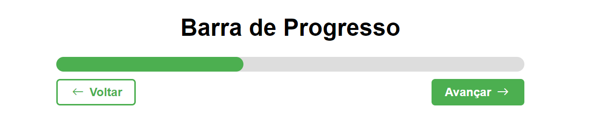

# progress-bar

## 🖥️ Projeto

Projeto Barra de Progresso. Barra de Progresso muito utilizada em sites que precisam ser feito ações progressivas, como por exemplo, um formulário de várias etapas.

Temos 2 botões, 1 botão "avançar" que ao clicar a barra cresce. E 1 botão para "voltar" que ao clicar a barra retorna. 

Projeto onde usamos a técnica de disparar eventos em JS para barra crescer e retornar ao clique dos botões.

## 🚀 Tecnologias

Esse projeto foi desenvolvido com as seguintes tecnologias:

- HTML
- CSS
- JavaScript
- Git e Github
